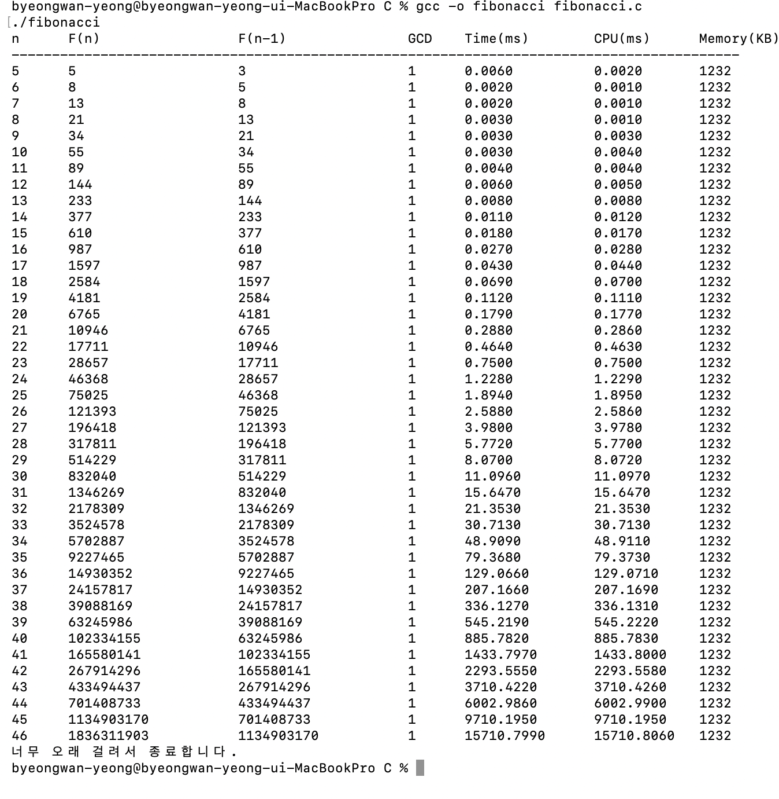

# 피보나치 수열 & GCD 프로파일링 보고서

## 1. 구현 코드

### 소스 코드 링크
- [`fibonacci.c`](./fibonacci.c)

### 피보나치 (재귀 구현)

```c
long long fibonacci(int n) {
    if (n <= 1) return n;
    return fibonacci(n - 1) + fibonacci(n - 2);
}
```

### GCD (유클리드 호제법, 반복 구현)

```c
static long long gcd(long long a, long long b) {
    if (a < 0) a = -a;
    if (b < 0) b = -b;
    while (b) {
        long long t = b;
        b = a % b;
        a = t;
    }
    return a;
}
```

### 프로파일링 (clock() 및 getrusage() 사용)

```c
clock_t start = clock();
struct rusage usage_start;
getrusage(RUSAGE_SELF, &usage_start);

long long fn   = fibonacci(n);
long long fn_1 = fibonacci(n - 1);
long long g    = gcd(fn, fn_1);

clock_t end = clock();
struct rusage usage_end;
getrusage(RUSAGE_SELF, &usage_end);

// 경과 시간 (ms)
double elapsed_ms = (double)(end - start) / CLOCKS_PER_SEC * 1000.0;

// CPU 사용 시간 (user + system, ms)
double cpu_total_ms = (cpu_user_ms) + (cpu_sys_ms);

// 메모리 사용량 (KB)
long mem_kb = usage_end.ru_maxrss / 1024;
```

`time.h`의 `clock()` 함수로 프로그램의 시작과 끝의 시간 차이를 측정하였다.  
`sys/resource.h`의 `getrusage()`로 CPU 사용 시간과 메모리 사용량을 측정하였다.  
이 출력값이 프로파일링 그래프를 대신한다.

---

## 2. 프로파일링 출력 결과

아래는 프로그램 실행 시 측정한 실제 출력 결과이다.



```
n      F(n)                 F(n-1)               GCD    Time(ms)        CPU(ms)      Memory(KB)
------------------------------------------------------------------------------------------
5      5                    3                    1      0.0060          0.0020       1232
6      8                    5                    1      0.0020          0.0010       1232
7      13                   8                    1      0.0020          0.0010       1232
8      21                   13                   1      0.0030          0.0010       1232
9      34                   21                   1      0.0030          0.0030       1232
10     55                   34                   1      0.0030          0.0040       1232
11     89                   55                   1      0.0040          0.0040       1232
12     144                  89                   1      0.0060          0.0050       1232
13     233                  144                  1      0.0080          0.0080       1232
14     377                  233                  1      0.0110          0.0120       1232
15     610                  377                  1      0.0180          0.0170       1232
16     987                  610                  1      0.0270          0.0280       1232
17     1597                 987                  1      0.0430          0.0440       1232
18     2584                 1597                 1      0.0690          0.0700       1232
19     4181                 2584                 1      0.1120          0.1110       1232
20     6765                 4181                 1      0.1790          0.1770       1232
21     10946                6765                 1      0.2880          0.2860       1232
22     17711                10946                1      0.4640          0.4630       1232
23     28657                17711                1      0.7500          0.7500       1232
24     46368                28657                1      1.2280          1.2290       1232
25     75025                46368                1      1.8940          1.8950       1232
26     121393               75025                1      2.5880          2.5860       1232
27     196418               121393               1      3.9800          3.9780       1232
28     317811               196418               1      5.7720          5.7700       1232
29     514229               317811               1      8.0700          8.0720       1232
30     832040               514229               1      11.0960         11.0970      1232
31     1346269              832040               1      15.6470         15.6470      1232
32     2178309              1346269              1      21.3530         21.3530      1232
33     3524578              2178309              1      30.7130         30.7130      1232
34     5702887              3524578              1      48.9090         48.9110      1232
35     9227465              5702887              1      79.3680         79.3730      1232
36     14930352             9227465              1      129.0660        129.0710     1232
37     24157817             14930352             1      207.1660        207.1690     1232
38     39088169             24157817             1      336.1270        336.1310     1232
39     63245986             39088169             1      545.2190        545.2220     1232
40     102334155            63245986             1      885.7820        885.7830     1232
41     165580141            102334155            1      1433.7970       1433.8000    1232
42     267914296            165580141            1      2293.5550       2293.5580    1232
43     433494437            267914296            1      3710.4220       3710.4260    1232
44     701408733            433494437            1      6002.9860       6002.9900    1232
45     1134903170           701408733            1      9710.1950       9710.1950    1232
46     1836311903           1134903170           1      15710.7990      15710.8060   1232
너무 오래 걸려서 종료합니다.
```

---

## 3. 시간복잡도 분석 및 검증

### 3.1 재귀 피보나치의 시간복잡도

재귀 피보나치의 호출 구조를 분석하면 다음과 같다.

```
T(n) = T(n-1) + T(n-2) + O(1)
```

이 점화식의 해는 황금비 φ ≈ 1.618에 의해 결정된다.

```
T(n) = O(φⁿ)  ≈  O(1.618ⁿ)
→ Big-O: O(2ⁿ)
```

**측정값으로 검증:**

| n  | Time(ms)   | CPU(ms)    | 비율 T(n)/T(n-1) |
|----|------------|------------|-----------------|
| 38 | 336.1270   | 336.1310   | —               |
| 39 | 545.2190   | 545.2220   | ≈ 1.62          |
| 40 | 885.7820   | 885.7830   | ≈ 1.62          |
| 41 | 1433.7970  | 1433.8000  | ≈ 1.62          |
| 42 | 2293.5550  | 2293.5580  | ≈ 1.60          |
| 43 | 3710.4220  | 3710.4260  | ≈ 1.62          |
| 44 | 6002.9860  | 6002.9900  | ≈ 1.62          |
| 45 | 9710.1950  | 9710.1950  | ≈ 1.62          |
| 46 | 15710.7990 | 15710.8060 | ≈ 1.62          |

→ n이 1 증가할 때마다 시간이 약 **1.62배** 증가한다.  
→ 이는 황금비 **φ ≈ 1.618**과 일치하므로 **O(φⁿ) = O(2ⁿ) 검증 완료**

### 3.2 CPU 사용량 분석

`getrusage()`로 측정한 CPU 사용 시간(user time + system time)은 경과 시간(Time)과 거의 동일한 값을 보인다. 이는 해당 프로그램이 **CPU를 100% 가까이 점유**하며 동작한다는 것을 의미한다.

재귀 피보나치는 I/O나 대기 없이 순수하게 CPU 연산만 수행하기 때문에, CPU 사용 시간이 경과 시간과 거의 일치하는 것은 당연한 결과이다. CPU 사용량 역시 시간복잡도와 동일하게 **O(2ⁿ)** 의 지수적 증가 패턴을 보인다.

### 3.3 메모리 사용량 분석

측정 결과 메모리 사용량은 모든 n에서 **1232KB로 일정**하였다.  
이는 macOS 환경에서 현재 시점의 메모리를 직접 측정하는 API가 없어, `getrusage()`의 `ru_maxrss`를 사용하였기 때문이다. 해당 값은 프로세스가 시작된 이후 **누적 최대 메모리(peak RSS)** 를 반환하므로, n이 증가해도 값이 변하지 않는 한계가 있다.  
재귀 피보나치의 실제 스택 메모리는 호출 깊이 n에 비례하므로 이론적 공간복잡도는 **O(n)** 이다.

### 3.4 GCD의 시간복잡도

연속한 피보나치 수 F(n), F(n-1)에 유클리드 호제법을 적용하면 최악의 경우가 된다.

```
GCD(F(n), F(n-1))
= GCD(F(n-1), F(n-2))    ← F(n) mod F(n-1) = F(n-2)
= GCD(F(n-2), F(n-3))
  ...
= GCD(F(2), F(1)) = 1
```

반복 횟수 = 정확히 **n-1번**

F(n)의 크기 기준으로 보면:

```
F(n) ≈ φⁿ/√5  →  n ≈ log_φ(F(n))
GCD 반복 횟수 = n-1 ≈ log_φ(F(n))
→ Big-O: O(log(min(F(n), F(n-1))))
```

→ 출력 결과에서 GCD(F(n), F(n-1))는 모든 n에서 **항상 1**로 측정되었다.  
→ 이는 연속한 피보나치 수가 항상 서로소라는 수학적 성질을 실험적으로 검증한다.

---

## 4. Big-O 정리

| 알고리즘 | 시간복잡도 | 공간복잡도 |
|----------|------------|------------|
| 재귀 피보나치 F(n) | **O(2ⁿ)** [정확히 O(φⁿ)] | O(n) |
| 유클리드 GCD(a, b) | **O(log(min(a, b)))** | O(1) |

---

## 5. 결론

1. **재귀 피보나치**는 중복 계산으로 인해 시간복잡도가 `O(2ⁿ)`이며, 측정값에서 n이 1 증가할 때 약 **1.62배** 증가하는 지수적 성장이 확인되었다. 이는 황금비 φ ≈ 1.618과 일치한다.

2. **CPU 사용 시간**은 경과 시간과 거의 동일하게 측정되어, 재귀 피보나치가 CPU를 100% 가까이 점유하며 동작함을 확인하였다. CPU 사용량 역시 **O(2ⁿ)** 의 지수적 증가 패턴을 따른다.

3. **메모리 사용량**은 측정 방식의 한계로 전 구간에서 1232KB로 일정하게 나타났으나, 재귀 호출 스택의 깊이가 n에 비례하므로 이론적 공간복잡도는 **O(n)** 이다.

4. **GCD(유클리드 호제법)** 는 연속 피보나치 수를 입력으로 받을 때 최악의 경우이며, 정확히 n-1번 반복한다. 입력값의 크기 기준으로 **O(log n)** 으로 매우 효율적이다.

5. n=46에서 약 **15.7초** 소요되어 프로그램이 종료되었으며, 이는 재귀 피보나치의 지수적 시간복잡도를 실험적으로 검증한다.
