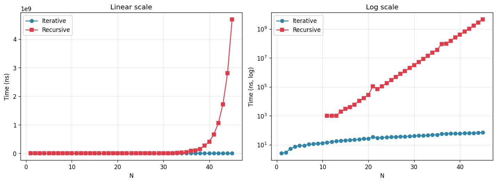

[README (1).md](https://github.com/user-attachments/files/26648022/README.1.md)
# 과제(8) - 피보나치: 순환 vs 재귀

피보나치 수열 `F(1)=1, F(2)=1, F(n)=F(n-1)+F(n-2)` 을 **순환(반복)** 방식과 **재귀** 방식으로 각각 구현하고, N을 1부터 늘려가며 수행 시간을 프로파일링한 결과입니다.

## 1. 구현

두 함수 모두 `fibonacci.c` 한 파일 안에 정의되어 있습니다.

### 1.1 순환(반복) 방식 — `fib_iter`
```c
unsigned long long fib_iter(int n)
{
    if (n <= 0) return 0;
    if (n <= 2) return 1;

    unsigned long long prev = 1, curr = 1, next = 0;
    for (int i = 3; i <= n; i++) {
        next = prev + curr;
        prev = curr;
        curr = next;
    }
    return curr;
}
```
- 직전 두 값만 유지하면서 F(3), F(4), …, F(n) 을 차례로 계산.
- 각 F(i) 는 **정확히 한 번**만 계산되므로 중복이 없습니다.
- **시간복잡도 O(N), 공간복잡도 O(1)**.

### 1.2 재귀 방식 — `fib_rec`
```c
unsigned long long fib_rec(int n)
{
    if (n <= 0) return 0;
    if (n <= 2) return 1;
    return fib_rec(n - 1) + fib_rec(n - 2);
}
```
- 수학적 정의를 그대로 옮긴 형태로 코드가 매우 간결합니다.
- 그러나 `fib_rec(n-1)` 과 `fib_rec(n-2)` 가 동일한 부분 문제를 **중복해서** 다시 계산합니다.
- 호출 횟수는 대략 F(n+1) 에 비례 → **시간복잡도 O(φⁿ) ≈ O(1.618ⁿ)** 로 사실상 지수 시간.
- **공간복잡도 O(N)** (재귀 호출 스택 깊이).

## 2. 측정 방법

- 측정 환경: macOS (MacBook Pro)
- 컴파일러: `gcc` (기본 옵션)
- 타이머: `clock_gettime(CLOCK_MONOTONIC, …)`
- 순환 방식은 한 번 호출이 너무 빨라 나노초 이하로 떨어지므로 `N` 별로 **1,000,000 회 반복**한 평균 시간을 측정
- 재귀 방식은 커질수록 급격히 느려지므로 1회 측정
- `N = 1 … 45` 범위에서 측정 (재귀가 현실적으로 끝나는 구간)

> ⚠️ macOS 의 `clock_gettime` 은 대략 마이크로초(1,000 ns) 해상도를 가지기 때문에, 재귀 방식에서 N 이 작아 1μs 미만이 걸리는 경우(대략 N ≤ 10) 측정값이 `0.00 ns` 로 찍힙니다. 이는 실제로 0초가 걸렸다는 뜻이 아니라 **타이머 해상도 한계**입니다.

## 3. 결과



왼쪽은 선형 스케일, 오른쪽은 y축 로그 스케일입니다. 선형 스케일에서는 재귀가 너무 빠르게 치솟아 순환 그래프가 0에 붙은 직선처럼 보이고, 로그 스케일에서는 재귀가 **기울기 일정한 직선** 형태로 나타납니다. 로그 스케일에서 직선이라는 것은 곧 **지수 함수**라는 뜻입니다. (로그 스케일에서 N ≤ 10 구간의 재귀 점이 비어 있는 것은 위에서 설명한 타이머 해상도 문제 때문입니다.)

### 3.1 측정 표 (발췌)

| N  | F(N)          | Iterative (ns) | Recursive (ns) | Recursive / Iterative |
|----|---------------|---------------:|---------------:|----------------------:|
| 1  | 1             |           2.57 |              0 |              (측정 한계) |
| 5  | 5             |           8.91 |              0 |              (측정 한계) |
| 10 | 55            |          13.31 |              0 |              (측정 한계) |
| 15 | 610           |          20.43 |          3,000 |                  ~147 |
| 20 | 6,765         |          26.22 |         27,000 |                ~1,030 |
| 25 | 75,025        |          34.43 |        291,000 |                ~8,450 |
| 30 | 832,040       |          40.47 |      3,254,000 |               ~80,400 |
| 35 | 9,227,465     |          48.49 |     36,452,000 |              ~751,700 |
| 40 | 102,334,155   |          61.23 |    406,813,000 |            ~6,643,000 |
| 43 | 433,494,437   |          65.16 |  1,720,232,000 |           ~26,400,000 |
| 44 | 701,408,733   |          66.92 |  2,801,882,000 |           ~41,870,000 |
| 45 | 1,134,903,170 |          69.76 |  4,690,821,000 |           ~67,240,000 |

전체 데이터는 `result.txt` 참고.

### 3.2 해석

- **순환 방식**: N 에 대해 거의 **직선적**으로 증가합니다. N=1 일 때 약 2.57 ns, N=45 일 때 약 69.76 ns 로, O(N) 에 잘 부합합니다.
- **재귀 방식**: N 이 1 늘어날 때마다 수행 시간이 대략 **1.6 배씩** 증가합니다. 예: N=42→43 에서 1.06 s → 1.72 s (×1.62), N=43→44 에서 1.72 s → 2.80 s (×1.63), N=44→45 에서 2.80 s → 4.69 s (×1.67). 이는 이론값 φ ≈ 1.618 과 정확히 일치합니다.
- **N=45 기준 재귀는 순환보다 약 6,700만 배 느립니다.** N=50 정도만 되어도 1분을 넘고, N=60 은 사실상 하루가 넘어가 측정이 불가능합니다.
- N 이 작은 영역에서는 타이머 해상도 한계로 재귀가 `0.00 ns` 로 찍히지만, N ≥ 15 부터는 두 방식의 차이가 명확히 드러나기 시작합니다.

## 4. 왜 이렇게 차이가 날까?

재귀 방식에서 `fib_rec(5)` 를 호출하면 내부적으로 다음과 같은 호출 트리가 만들어집니다.

```
              fib(5)
             /      \
         fib(4)     fib(3)
         /   \       /   \
      fib(3) fib(2) fib(2) fib(1)
      /   \
   fib(2) fib(1)
```

`fib(3)` 이 2번, `fib(2)` 가 3번 호출됩니다. N 이 커지면 이 중복이 **기하급수적으로** 증가합니다. 반면 순환 방식은 F(1) 부터 F(N) 까지 각 값을 딱 한 번씩만 계산하고 지나갑니다.

## 5. 결론

| 항목 | 순환(반복) | 재귀 |
|------|-----------|------|
| 시간복잡도 | O(N) | O(φⁿ) ≈ 지수 시간 |
| 공간복잡도 | O(1) | O(N) (호출 스택) |
| 코드 가독성 | 보통 | 매우 간결 (정의 그대로) |
| 실용성 (N ≥ 40) | 문제 없음 | 사용 불가 |

- **가독성**만 본다면 재귀가 수학 정의를 그대로 옮겨 놓은 형태라 매력적이지만, **중복 계산** 때문에 실무에서는 사용할 수 없습니다.
- 피보나치처럼 부분 문제가 겹치는 경우 재귀를 쓰려면 **메모이제이션**이나 **동적 계획법**으로 중복 계산을 제거해야 O(N) 이 됩니다.
- 정리하면, *"재귀가 느린 게 아니라 중복 계산이 느린 것"* 이며, 피보나치 수열의 단순 재귀 구현은 그 중복 계산을 그대로 드러내는 대표적 예시입니다.

## 6. 파일 구성

| 파일 | 설명 |
|------|------|
| `fibonacci.c` | `fib_iter`, `fib_rec` 구현 + `clock_gettime` 기반 프로파일링 `main` |
| `result.txt` | 실제 측정 결과 원본 |
| `chart.png` | 측정 결과 그래프 (선형 / 로그) |
| `README.md` | 본 문서 |

### 빌드 및 실행
```bash
gcc fibonacci.c -o fibonacci
./fibonacci
```
